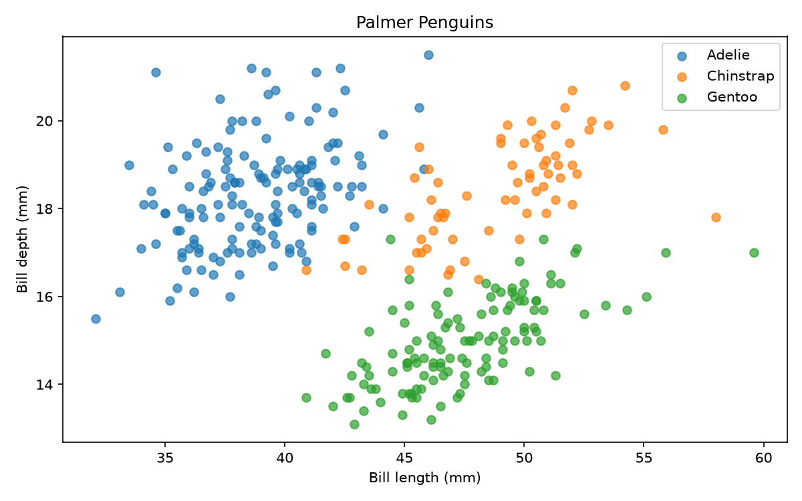

# Palmer Penguins 🐧

Учебный ML-проект для PMLDL Assignment 1. Приложение определяет вид пингвина
**Adelie, Chinstrap или Gentoo** по четырём измерениям: длине и глубине клюва,
длине ласта и массе тела. Для классификации используется логистическая регрессия.


Artwork by @allison_horst · [Источник иллюстрации](https://allisonhorst.github.io/palmerpenguins/articles/art.html)

## Данные

[Palmer Penguins](https://github.com/allisonhorst/palmerpenguins) — 344 наблюдения
трёх видов пингвинов. Данные собраны Kristen Gorman и Palmer Station LTER
и доступны по лицензии CC0. CSV включён в репозиторий: `data/raw/penguins.csv`.
Пол, остров и год используются в исследовании, но не входят в признаки модели.

## Как работает пайплайн

1. **Исследование данных.** Скрипт читает CSV, проверяет пропуски и распределение
   видов и измерений. Результат: таблицы, графики и текстовый отчёт.

2. **Препроцессинг.** Удаляются дубликаты и строки без вида.
   Данные делятся на train/test в пропорции 80/20 с сохранением долей классов.
   Выбросы удаляются только из train; пропуски в обеих выборках заполняются
   медианами train.

3. **Обучение и оценка.** StandardScaler масштабирует признаки, логистическая
   регрессия обучается на train. На test вычисляются accuracy и macro F1.
   Модель сохраняется вместе с обработкой признаков, а метрики - в отдельный файл.

4. **Запуск приложения.** Docker Compose собирает и запускает два контейнера:
   FastAPI с моделью и Streamlit с веб-интерфейсом. Пользователь вводит измерения,
   приложение обращается к API и показывает предсказанный вид с фотографией.

Полный цикл повторяется каждые 5 минут при запуске с `--schedule`.
Ошибка останавливает текущий прогон; следующая попытка выполняется по расписанию.

## Структура проекта

```text
penguins/                  # Код проекта
├── datasets/              # Загрузка CSV, EDA и препроцессинг
├── models/                # Обучение, оценка и сохранение модели
├── deployment/
│   ├── api/               # FastAPI и его Dockerfile
│   └── app/               # Streamlit и его Dockerfile
├── assets/                # Фотографии пингвинов и лицензии
├── config.py              # Пути, признаки и параметры обучения
├── display.json           # Подписи полей и сведения о видах
├── pipeline.py            # Последовательность этапов и расписание
└── run_once.py            # Разовый запуск с выводом в терминал

data/
├── raw/                   # Исходный CSV из репозитория
└── processed/             # Подготовленные train/test и медианы

models/                    # Обученная модель
reports/                   # Метрики, графики и журналы запусков
└── eda/                   # Подробный отчёт об исследовании данных

tests/                     # Проверки данных, API, интерфейса и расписания
compose.yaml               # Настройки контейнеров и портов
requirements.txt           # Python-зависимости
```

`data/processed/` и `models/` заполняются при запуске пайплайна.

## Установка и запуск

Нужны **Python 3.12**, запущенный **Docker Desktop с Linux-контейнерами**
и свободные порты **8000** и **8501**. Первая установка требует интернета
для Python-зависимостей и Docker-образов.

Из корня репозитория в **Git Bash на Windows**:

```bash
python -m venv .venv
source .venv/Scripts/activate
python -m pip install -r requirements.txt
python -m penguins.run_once
```

На Linux/macOS создайте окружение командой `python3 -m venv .venv`
и активируйте через `source .venv/bin/activate`; остальные команды те же.

После запуска:

- **Приложение:** http://localhost:8501 — введите измерения и нажмите «Определить вид».
- **API:** http://localhost:8000/docs — документация и пробные запросы.

Фотографии видов хранятся локально и доступны в приложении без интернета.
Авторы и лицензии указаны под фотографиями и в [ATTRIBUTION.md](penguins/assets/ATTRIBUTION.md).

Запуск по расписанию:

```bash
python -m penguins.pipeline --schedule
```

Оставьте терминал открытым и запускайте только один планировщик. Если прогон
длится 5 минут или дольше, следующий начнётся через 5 минут после его завершения.
Интервал можно увеличить: `--interval 600`. При обновлении контейнеров приложение
кратковременно недоступно. `Ctrl+C` останавливает планировщик; контейнеры — отдельно:

```bash
docker compose down
```

## Исследование и результаты

Отдельный запуск EDA и проверок:

```bash
python -m penguins.datasets.explore
python -m unittest discover -s tests -v
```

Тесты выполняются после первого обучения. Для обучения без Docker:
`python -m penguins.run_once --skip-deploy`.

- `reports/eda/report.txt` — выводы EDA; рядом лежат таблицы и графики.
- `reports/metrics.json` — метрики последнего обучения.
- `reports/run-*.log` — подробные журналы запусков через планировщик.
- `data/processed/` и `models/` — подготовленные выборки и модель, создаются при запуске.



## Ограничения

Это **учебный пример**. В датасете нет
птенцов; модель не предназначена для них и для видов, отличных от трёх изученных.
Масса и размеры отдельных птиц могут выходить за наблюдаемые диапазоны.

Проверки не определяют биологически неправдоподобные сочетания признаков.
Даже допустимые по отдельности размеры могут описывать нетипичную птицу, высокая вероятность класса не гарантирует верный ответ. 
